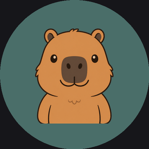
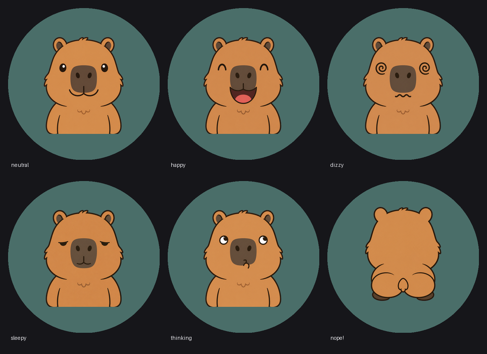
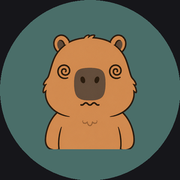
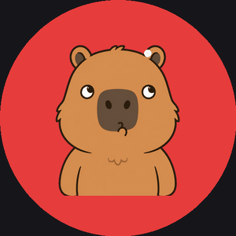
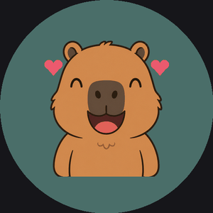
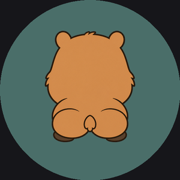

<h1 align="center">capybot 🦫</h1>

<p align="center"><b>Carl Nintendo</b> — a spin-to-ask capybara oracle for the Elecrow CrowPanel 2.1&quot; round display.</p>

<p align="center">
  
</p>

<p align="center"><i>Ask Carl a yes/no question, spin the knob, and let fate (and a capybara) decide.</i></p>

---

## What is it?

capybot runs on an **ESP32-S3** driving a **480×480 round IPS display** with a rotary knob. Carl is the capybara who lives on it. Spin the knob while you ask him a yes/no question — his face spins with the dial — then he gets dizzy, mulls it over with a game-show color drumroll, and gives you his verdict: a happy dance for **yes**, or he turns around, drops a poop, and does a little duet with it for **no**.

## Carl's moods

<p align="center">
  
</p>

## How he answers

<table align="center">
<tr>
  <td align="center"><br><b>1. Spin</b><br>Ask + spin the knob;<br>Carl's face spins along</td>
  <td align="center"><br><b>2. Dizzy</b><br>Stop spinning and<br>he goes woozy</td>
  <td align="center"><br><b>3. Thinking</b><br>Color drumroll while<br>he makes up his mind</td>
</tr>
<tr>
  <td align="center"><br><b>4a. YES</b><br>Happy bounce + hearts</td>
  <td align="center" colspan="2"><br><b>4b. NO</b><br>Turns around, poops, and<br>the two of them dance together</td>
</tr>
</table>

The answer is a genuine 50/50 coin flip (hardware RNG), and each phase lasts a randomized time so it never feels scripted.

## Controls

| Input | Action |
|---|---|
| **Spin knob** | Ask a question — Carl's face spins with the dial |
| **Tap knob** | Ask again (shortcut) |
| **Hold knob** (~0.7s) | Splash / title card |
| **Touch screen** | Pet Carl (hearts, he glances at your finger) |

## Hardware

- **[Elecrow CrowPanel 2.1&quot; HMI Rotary Display](https://www.elecrow.com/)** — ESP32-S3 (16MB flash, 8MB OPI PSRAM)
- 480×480 round IPS panel, **ST7701** RGB controller
- Rotary encoder + push button, capacitive touch (**CST8xx**)
- Native USB-C (no driver needed on macOS)

## How it works

- **Art → device.** Carl's six expressions are drawn as flat-color sprites, cleaned and registered, packed to **RLE-compressed RGB565** (`carl_sprites.h`, ~0.5 MB), decoded into **PSRAM at boot**, and composited into a **double-buffered canvas** (`Arduino_Canvas` → `flush`) so nothing flickers.
- **Live spin.** The spin is a real-time **rotozoom** of the neutral sprite, so it tracks the knob rather than playing a canned loop.
- **The flash.** During "thinking," the background is recolored *behind* Carl using a color-key blit (his baked-in background pixels are swapped for the drumroll color).
- **No LVGL.** Everything is drawn with **[Arduino_GFX](https://github.com/moononournation/Arduino_GFX)** only.

## Build & flash

1. **Arduino IDE 2.x** with the **ESP32 core 2.0.14** (the ST7701 setup targets 2.0.x).
2. Copy the required libraries into `~/Documents/Arduino/libraries/`: `GFX_Library_for_Arduino`, `Adafruit_CST8XX_Library` (+ `Adafruit_BusIO`, `Adafruit_GFX`), and `PCF8574`.
3. Open `capybot.ino` and set **Tools →**:

   | Setting | Value |
   |---|---|
   | Board | ESP32S3 Dev Module |
   | Flash Size | 16MB |
   | Partition Scheme | Huge APP |
   | PSRAM | OPI PSRAM |
   | USB CDC On Boot | **Enabled** |
   | USB Mode | **Hardware CDC and JTAG** |

4. **Upload.** On this board the first upload of a session needs the bootloader dance: **hold BOOT, tap RESET, release BOOT**, then Upload. When it hangs on *"Hard resetting via RTS pin,"* tap **RESET** to run. Re-uploads auto-reset.

## Asset pipeline

Carl's art regenerates from source PNGs through the scripts in [`tools/`](tools/):

```
carl_*.png (magenta bg)                # 6 expressions from an image model
  → tools/process_sprites.sh           # key bg, register, resize  → sprites/
  → tools/sprites_to_header.py         # RGB565 + RLE              → carl_sprites.h
  → tools/make_gifs.py                 # the preview GIFs above    → docs/
```

`process_sprites.sh` bootstraps its own Python venv on first run.

## Repo layout

```
capybot.ino           the sketch (rendering + oracle state machine)
carl_sprites.h        generated sprite data (RLE RGB565)
carl_*.png            source expression art
tools/                the asset pipeline
docs/                 preview GIFs + expressions grid
```

---

<p align="center"><sub>Carl's art generated with ChatGPT image generation · built with the help of Claude Code.</sub></p>
